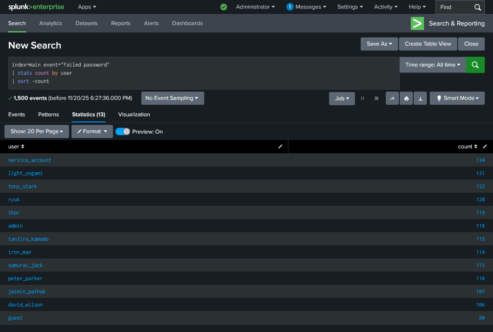
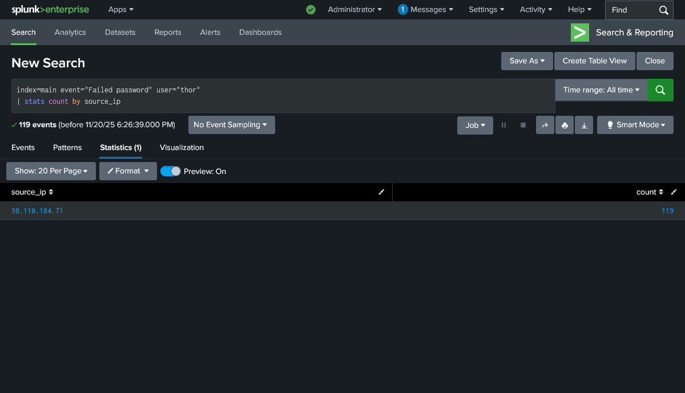
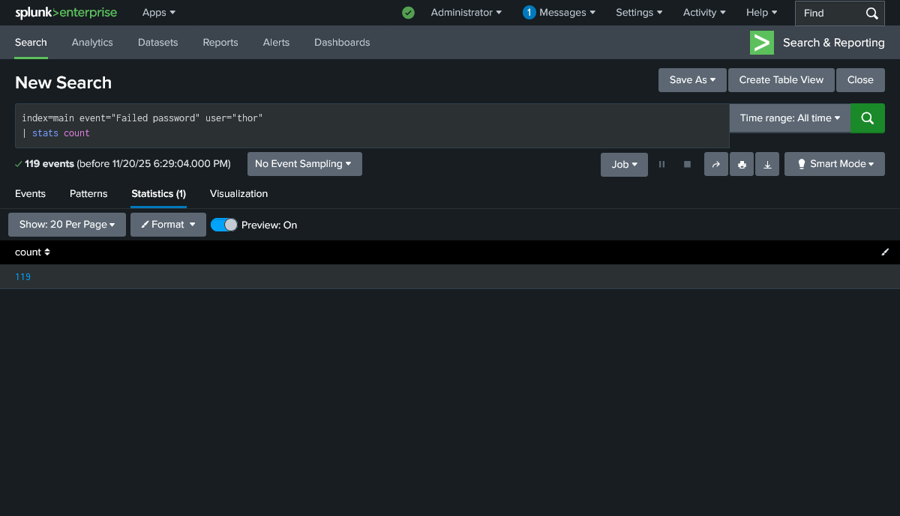

# SSH Brute Force Attack Analysis

For this project I used Splunk to detect and investigate an SSH brute-force attack by analyzing failed login logs and identifying suspicious IPs using SPL queries.


## Data Set

Data Source: JSON-formatted Linux Auth logs (uploaded manually into Splunk).

I sued this JSON file:

**[Linux Auth Log File](./data/linux_auth_logs.json)**


## SPL Queries and FIndings


Using SPL queries, I found which user has attempted the most number of SSH brute attack attempts:
```spl
index=main event="Failed password"
| stats count by user
| sort -count
```



Then, I found the IP Address of the user "thor":
```spl
index=main event="Failed password" user="thor"
| stats count by source_ip
```



Finally, I found how many times user "thor" failed to login:
```spl
index=main event="Failed password" user="thor"
| stats count
```



